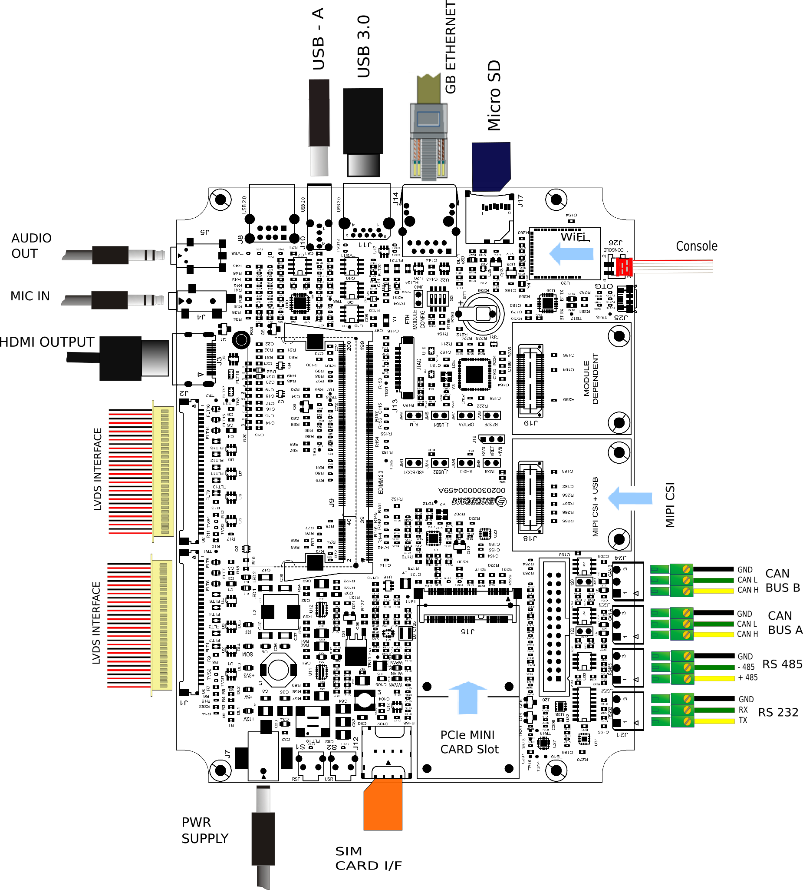

# Test Sheet iCore STM32MP2 — EDIMM Starterkit 2.0



---

## Kernel

| Status | Test              | Notes      |
|--------|-------------------|------------|
| OK     | Ethernet          |            |
| OK     | USB               |            |
| OK     | MMC card          |            |
| OK     | EMMC Flash        |            |
| OK     | Display           |            |
| OK     | UART 232          | `ttySTM1`  |
| OK     | UART 485          | `ttySTM2`  |
| OK     | Linux Console     | `ttySTM0`  |
| OK     | CANBUS1           |            |
| OK     | CANBUS2           |            |
| OK     | WIFI              |            |
| OK     | Bluetooth         |            |
| OK     | Touchscreen       |            |
| OK     | Backlight Control |            |
| OK     | CSI camera        |            |

---

## UART 232

On `J21` connector close TX with RX and use minicom on `ttySTM1` to test local echo.

---

## UART 485

Tested `/dev/ttySTM2` (connector `J22`) with another RS485 device. Configure minicom:

```bash
minicom -s
```

Configure the Serial Port Setup as shown:


---

## Wi-Fi

```bash
ifconfig eth0 down
echo "nameserver 8.8.8.8" > /etc/resolv.conf
ifconfig wlan0 up
iw dev wlan0 scan | grep SSID
wpa_passphrase SSID password > /etc/wpa_supplicant.conf
wpa_supplicant -iwlan0 -Dnl80211 -c/etc/wpa_supplicant.conf -B
udhcpc -i wlan0
```

---

## Bluetooth

```bash
brcm_patchram_plus --patchram /lib/firmware/brcm/BCM43430A1.hcd --enable_hci \
--no2bytes --tosleep 1000 --baudrate 3000000 \
--use_baudrate_for_download /dev/ttyUSB0 &

hciconfig hci0 up
bluetoothctl
agent on
scan on
```

---

## CAN Interfaces

Connect the CANBUS connectors J23 and J24.

```bash
ip link set can0 type can bitrate 125000
ip link set can1 type can bitrate 125000
ifconfig can0 up
ifconfig can1 up

cansend can0 123#1122334455667788
candump can0

cansend can1 123#1122334455667788
candump can1
```

---

## Backlight Control

```bash
echo 1 > /sys/class/backlight/panel-backlight/brightness
echo 0 > /sys/class/backlight/panel-backlight/brightness
```

---

## CSI Camera

Tested with Arducam OV5640 connected via 470- adapter to connector `J18`.

**Resolution 640x480:**

```bash
media-ctl -d platform:48030000.dcmipp -r
media-ctl -d platform:48030000.dcmipp -l '"48020000.csi":1->"dcmipp_input":0[1]'
media-ctl -d platform:48030000.dcmipp -l "'dcmipp_input':2->'dcmipp_main_isp':0[1]"
media-ctl -d platform:48030000.dcmipp --set-v4l2 '"ov5640 0-003c":0[fmt:RGB565_1X16/640x480]'
media-ctl -d platform:48030000.dcmipp --set-v4l2 '"48020000.csi":1[fmt:RGB565_1X16/640x480]'
media-ctl -d platform:48030000.dcmipp --set-v4l2 '"dcmipp_input":2[fmt:RGB565_1X16/640x480 field:none]'
media-ctl -d platform:48030000.dcmipp --set-v4l2 '"dcmipp_main_isp":1[fmt:RGB888_1X24/640x480 field:none]'
media-ctl -d platform:48030000.dcmipp --set-v4l2 '"dcmipp_main_postproc":0[compose:(0,0)/640x480]'
media-ctl -d platform:48030000.dcmipp --set-v4l2 '"dcmipp_main_postproc":1[fmt:RGB888_1X24/640x480]'

gst-launch-1.0 v4l2src device=/dev/video1 ! 'video/x-raw,format=RGB16,width=640,height=480,framerate=30/1' ! videoconvert ! autovideosink
```

**Resolution 1024x600:**

```bash
media-ctl -d platform:48030000.dcmipp -r
media-ctl -d platform:48030000.dcmipp -l '"48020000.csi":1->"dcmipp_input":0[1]'
media-ctl -d platform:48030000.dcmipp -l "'dcmipp_input':2->'dcmipp_main_isp':0[1]"
media-ctl -d platform:48030000.dcmipp --set-v4l2 '"ov5640 0-003c":0[fmt:RGB565_1X16/1024x600]'
media-ctl -d platform:48030000.dcmipp --set-v4l2 '"48020000.csi":1[fmt:RGB565_1X16/1024x600]'
media-ctl -d platform:48030000.dcmipp --set-v4l2 '"dcmipp_input":2[fmt:RGB565_1X16/1024x600 field:none]'
media-ctl -d platform:48030000.dcmipp --set-v4l2 '"dcmipp_main_isp":1[fmt:RGB888_1X24/1024x600 field:none]'
media-ctl -d platform:48030000.dcmipp --set-v4l2 '"dcmipp_main_postproc":0[compose:(0,0)/1024x600]'
media-ctl -d platform:48030000.dcmipp --set-v4l2 '"dcmipp_main_postproc":1[fmt:RGB888_1X24/1024x600]'

gst-launch-1.0 v4l2src device=/dev/video1 ! 'video/x-raw,format=RGB16,width=1024,height=600,framerate=30/1' ! videoconvert ! autovideosink
```
