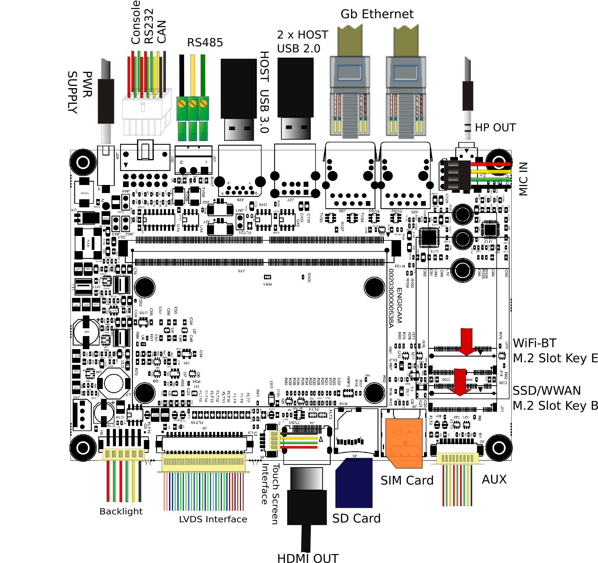

# Test Sheet SmarCore STM32MP2 — X.Touch 2.0



---

## Kernel

| Status | Test              | Notes      |
|--------|-------------------|------------|
| OK     | Ethernet 1        | `end1`     |
| OK     | Ethernet 2        | `end0`     |
| OK     | USB               |            |
| OK     | MMC card          |            |
| OK     | EMMC Flash        |            |
| OK     | Display           |            |
| OK     | UART 232          | `ttySTM1`  |
| OK     | UART 485          | `ttySTM2`  |
| OK     | Linux Console     | `ttySTM0`  |
| OK     | CANBUS1           |            |
| TBT    | CANBUS2           |            |
| TBT    | WIFI SOM          |            |
| OK     | WIFI PCIe         |            |
| TBT    | Bluetooth         |            |
| OK     | Touchscreen       |            |
| OK     | Backlight Control |            |

---

## Debug Console

Connect to the debug console on connector `J32` (pins 1-2).

---

## UART 232

On `J32` connector close TX with RX (pins 11-12) and use minicom on `ttySTM1` to test local echo.

---

## UART 485

Tested `/dev/ttySTM2` (connector `J31`) with another RS485 device. Configure minicom:

```bash
minicom -s
```

Configure the Serial Port Setup as shown:


---

## Wi-Fi PCIe

Tested using Intel Dual Band Wireless-AC 8265 Wi-Fi module (M.2 key E) on connector `J14`. Drivers load at boot time, or manually:

```bash
insmod /lib/modules/6.1.82/kernel/drivers/net/wireless/intel/iwlwifi/iwlwifi.ko firmware=iwlwifi-8265-34.ucode
insmod /lib/modules/6.1.82/kernel/net/mac80211/mac80211.ko
insmod /lib/modules/6.1.82/kernel/drivers/net/wireless/intel/iwlwifi/mvm/iwlmvm.ko
```

```bash
ifconfig end0 down
ifconfig end1 down
echo "nameserver 8.8.8.8" > /etc/resolv.conf
ifconfig wlan0 up
iw dev wlan0 scan | grep SSID
wpa_passphrase SSID password > /etc/wpa_supplicant.conf
wpa_supplicant -iwlan0 -Dnl80211 -c/etc/wpa_supplicant.conf -B
udhcpc -i wlan0
ip route add default via <gateway_IP> dev wlp1s0
ping -Iwlp1s0 8.8.8.8
```

---

## Bluetooth

```bash
brcm_patchram_plus --patchram /lib/firmware/brcm/BCM43430A1.hcd --enable_hci \
--no2bytes --tosleep 1000 --baudrate 3000000 \
--use_baudrate_for_download /dev/ttyUSB0 &

hciconfig hci0 up
bluetoothctl
agent on
scan on
```

---

## CAN Interfaces

Connect the CANBUS connectors on `J32` (pins 7-8).

```bash
ip link set can0 type can bitrate 125000
ip link set can1 type can bitrate 125000
ifconfig can0 up
ifconfig can1 up

cansend can0 123#1122334455667788
candump can0

cansend can1 123#1122334455667788
candump can1
```

---

## Backlight Control

```bash
echo 1 > /sys/class/backlight/panel-backlight/brightness
echo 0 > /sys/class/backlight/panel-backlight/brightness
```
