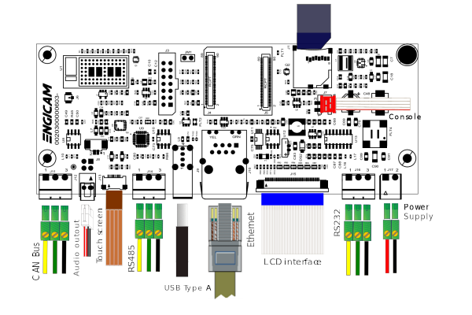
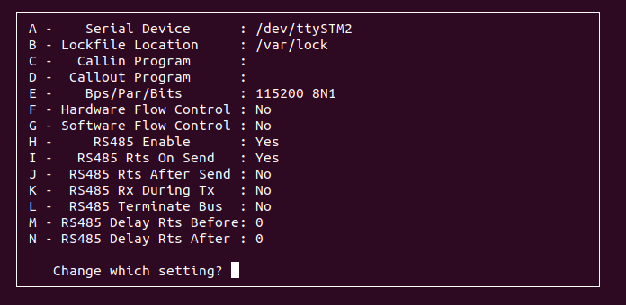

# Test Sheet MicroGea STM32MP2 — Micro 5



---

## Kernel

| Status | Test              | Notes      |
|--------|-------------------|------------|
| OK     | Ethernet          |            |
| OK     | USB               |            |
| OK     | MMC card          |            |
| OK     | Display           |            |
| OK     | UART 232          | `ttySTM3`  |
| OK     | UART 485          | `ttySTM1`  |
| OK     | Linux Console     | `ttySTM0`  |
| OK     | CANBUS1           | `can0`     |
| OK     | Audio             |            |
| OK     | Touchscreen       |            |
| OK     | Backlight Control |            |
| OK     | WIFI              |            |
| OK     | Bluetooth         | `ttySTM3`  |
| TBT    | UMTS              |            |

---

## UART 232

Connect TX/RX PIN connector to the UART 232 port on `J31`. From terminal run minicom:

```bash
minicom -s
```

Disable Hardware Flow Control and set `Serial Device` to `/dev/ttySTM3`. Check that characters typed from keyboard are echoed in the terminal.

---

## UART 485

Tested `/dev/ttySTM1` with another RS485 device. Configure minicom:

```bash
minicom -s
```

Configure the Serial Port Setup as shown:



---

## Wi-Fi

```bash
ifconfig end0 down
echo "nameserver 8.8.8.8" > /etc/resolv.conf
insmod /lib/modules/6.1.82/extra/mlan.ko
insmod /lib/modules/6.1.82/extra/moal.ko mod_para=nxp/wifi_mod_para.conf
ifconfig mlan0 up
iw dev mlan0 scan | grep SSID
wpa_passphrase SSID password > /etc/wpa_supplicant.conf
wpa_supplicant -imlan0 -Dnl80211 -c/etc/wpa_supplicant.conf -B
udhcpc -i mlan0
```

---

## Bluetooth

Available as option. May require antenna depending on `WIFI_MODE` state.

```bash
hciattach -b /dev/ttySTM4 any 3000000 flow
hciconfig hci0 up
hcitool scan
```

---

## CAN Interfaces

Connect CANBUS pins on `J2` to a compatible transceiver.

```bash
ip link set can0 type can bitrate 125000
ifconfig can0 up

cansend can0 123#1122334455667788
candump can0
```

---

## Audio

```bash
amixer -c 0 set 'ASI1 Sel' LeftRightDiv2
aplay /usr/share/sounds/alsa/Side_Right.wav
```

---

## Backlight Control

```bash
echo 1 > /sys/class/backlight/panel-backlight/brightness
echo 0 > /sys/class/backlight/panel-backlight/brightness
```

---

## Touchscreen

```bash
evtest
```

Expected output:

```
Available devices:
/dev/input/event0:      ilitek_ts
Select the device event number [0-0]
```

Press `0` and Enter, then touch the screen.
